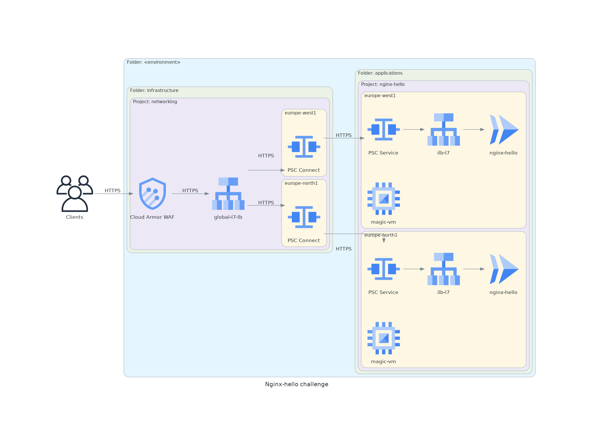

# About
This solution deploys `nginx-hello` application in a `nginx-hello` GCP project. Infrastructure elements (load balancers, DNS, certificated) are placed in a separate `networking` project managed in another `infra` (this) repository. The connectivity from `networking` project into `nginx-hello` application project is provided with the help of Private Service Connect (PSC). 

In this repo you will find Terraform code that deloys the following infrastrusture elements:
- `networking` GCP project in specified `infrastructure` folder
- Google-managed SSL certificate for Cloud Endpoint DNS record
- Global L7 HTTPS load balancer
- WAF service based on Cloud Armor policy
- PSC connections to the services in `nginx-hello` project

# Diagram



# How to use
## Dev
```
terraform init -backend-config="bucket=cl-challenge-dev"
terraform apply -var-file=vars/dev.tfvars
```
## Stage
```
terraform init -backend-config="bucket=cl-challenge-stage"
terraform apply -var-file=vars/stage.tfvars
```
## Prod
```
terraform init -backend-config="bucket=cl-challenge-prod"
terraform apply -var-file=vars/prod.tfvars
```

# Details
<!-- BEGIN_TF_DOCS -->
## Requirements

| Name | Version |
|------|---------|
| <a name="requirement_google"></a> [google](#requirement\_google) | =4.52.0 |
| <a name="requirement_google-beta"></a> [google-beta](#requirement\_google-beta) | =4.52.0 |

## Providers

| Name | Version |
|------|---------|
| <a name="provider_google"></a> [google](#provider\_google) | 4.52.0 |
| <a name="provider_google-beta"></a> [google-beta](#provider\_google-beta) | 4.52.0 |
| <a name="provider_random"></a> [random](#provider\_random) | 3.4.3 |

## Modules

| Name | Source | Version |
|------|--------|---------|
| <a name="module_cloud-ep-dns"></a> [cloud-ep-dns](#module\_cloud-ep-dns) | terraform-google-modules/endpoints-dns/google | n/a |
| <a name="module_cloud_armor"></a> [cloud\_armor](#module\_cloud\_armor) | GoogleCloudPlatform/cloud-armor/google | n/a |
| <a name="module_gce-lb-http"></a> [gce-lb-http](#module\_gce-lb-http) | GoogleCloudPlatform/lb-http/google | 7.0.0 |
| <a name="module_project-networking"></a> [project-networking](#module\_project-networking) | git@github.com:pavelrn/cl-challenge-base-project.git | v1.6 |

## Resources

| Name | Type |
|------|------|
| [google-beta_google_compute_global_address.lb-fe-ip](https://registry.terraform.io/providers/hashicorp/google-beta/4.52.0/docs/resources/google_compute_global_address) | resource |
| [google_compute_region_network_endpoint_group.psc-neg](https://registry.terraform.io/providers/hashicorp/google/4.52.0/docs/resources/compute_region_network_endpoint_group) | resource |
| [random_id.suffix](https://registry.terraform.io/providers/hashicorp/random/latest/docs/resources/id) | resource |

## Inputs

| Name | Description | Type | Default | Required |
|------|-------------|------|---------|:--------:|
| <a name="input_app_name"></a> [app\_name](#input\_app\_name) | n/a | `string` | n/a | yes |
| <a name="input_app_project_id"></a> [app\_project\_id](#input\_app\_project\_id) | n/a | `string` | n/a | yes |
| <a name="input_billing_account"></a> [billing\_account](#input\_billing\_account) | Billing account ID | `string` | n/a | yes |
| <a name="input_env"></a> [env](#input\_env) | Short environment name (dev, stage, prod) | `string` | n/a | yes |
| <a name="input_folder_id"></a> [folder\_id](#input\_folder\_id) | Parent folder ID | `string` | n/a | yes |
| <a name="input_regions"></a> [regions](#input\_regions) | Regions where the applications are deployed | `list(any)` | n/a | yes |
| <a name="input_vm_ip_cidr_range"></a> [vm\_ip\_cidr\_range](#input\_vm\_ip\_cidr\_range) | Project IP range used for VMs, le /24 (IP range is split across regions) | `string` | n/a | yes |

## Outputs

| Name | Description |
|------|-------------|
| <a name="output_convenience_message"></a> [convenience\_message](#output\_convenience\_message) | Convenience message |
| <a name="output_fe_ip_address"></a> [fe\_ip\_address](#output\_fe\_ip\_address) | n/a |
| <a name="output_network_id"></a> [network\_id](#output\_network\_id) | n/a |
| <a name="output_project_id"></a> [project\_id](#output\_project\_id) | n/a |
<!-- END_TF_DOCS -->